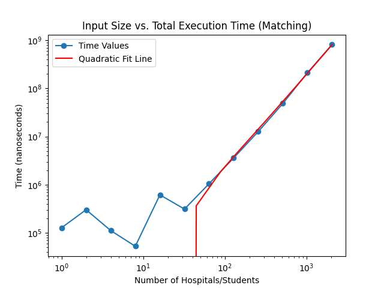
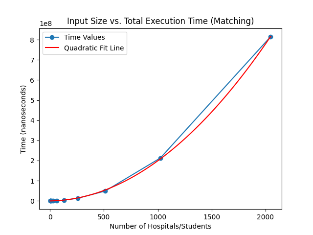
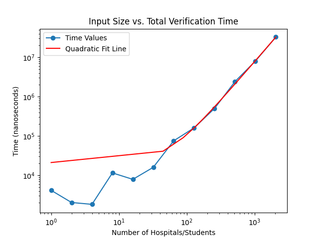
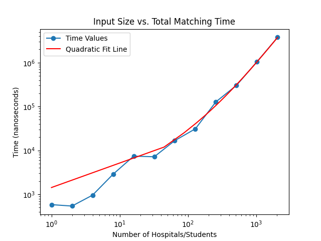

# Programming Assignment 1: Matching and Verifying

Students: Jeevan Iyadurai (31691151), Luke Gorman (43500015)

All code is in the src folder. All the algorithm code is in main.cpp. All the test case generation is in 
generate_cases.py. All the chart generation is in generate_charts.py.

To compile / build, you ideally should have CMake. Then use these commands to build:

1. mkdir build
2. cd build
3. cmake ..
4. ./pa1 \<flags\>

Otherwise, I would suggest creating a build directory and then compiling the binary to be there.

1. mkdir build
2. g++ -std=c++20 -o build/pa1 src/main.cpp
3. cd build
4. ./pa1 \<flags\>

To run the matcher, you can either run with generated input or manual input. 
There is some generated input in the inputs directory already, or you can run the generate_cases.py to generate more. 
Alternatively, you can pass the -m flag to pa1 to manually input a test case. First, give the size of the input, 
followed by the preference lists for that many hospitals and then the preference lists for that many students. If you do
not provide manual input, the output will be written to files in outputs. The files named Ntime.txt have time
information about how long it took to run with that value of N. The files named N.txt have the matchings that were
produced by the algorithm in sorted order. If you provide manual input, the results will be output to console.

To run the verifier, you can supply manual input. To do this, pass the flags -v -m after the program name. Then, supply 
the number N, the N preference lists for hospitals, the N preference lists for students, and finally N pairs between
hospitals and students. The program will output "VALID STABLE" if the matching is valid and stable, the program will
output "INVALID ..." with a reason if the input is deemed invalid, and it will output "UNSTABLE ..." with an unstable
pair that demonstrates why the matching is unstable. The verifier also runs normally, and will output its results of
verifying our matching algorithm's results.

If bad input is given, there are no guarantees about the program's execution. If an invalid preference list for a 
hospital or student is given, it is likely to throw an exception and crash. When verifying, the program should be able
to tell what is wrong with a given matching, e.g. a hospital was matched twice or wasn't matched. There is an unmatched 
participant when there is a duplicate or an invalid member of a matching, since otherwise the size will guarantee N
hospitals and students.

Here are the charts of the results for matching. Note that the first chart plots on a logarithmic x and y scale. 
During this run, the lowest total execution time was for N=8. 
When the input size is small, the time taken for the I/O is highly variant and makes up most of the execution time.
However, once the input size becomes larger, it is clear from the quadratic fit lines that the algorithm's running time
is approximately quadratic. This pattern can be observed in the total time for the algorithm, the verification of a
matching, and the matching itself. The timing was done with a very basic RAII-esque Timer that exists during the
lifetime it tries to measure, and the charts were produces with matplotlib.